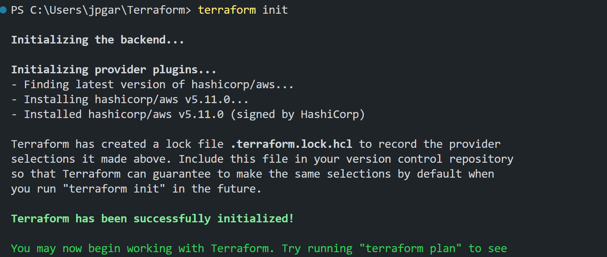
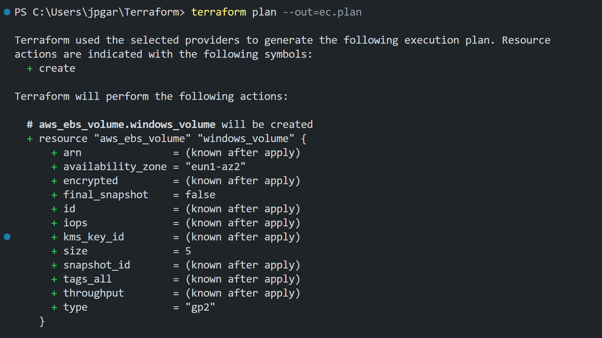

# Creación de Máquina Virtual Windows en AWS con Terraform

Este repositorio contiene los archivos de configuración de Terraform para provisionar una máquina virtual con Windows en Amazon Web Services (AWS). La máquina virtual tendrá un disco virtual de al menos 5 GB y se podrá acceder de forma remota a través del Protocolo de Escritorio Remoto (RDP).

## Requisitos previos

1. Tener una cuenta de AWS con credenciales de acceso válidas.
2. Tener Terraform instalado en tu sistema local.

## Pasos para la ejecución del provisionamiento


### Instala la AWS CLI:

Si aún no tienes la AWS CLI instalada en tu sistema, debes descargar e instalar la herramienta. Puedes encontrar instrucciones detalladas para tu sistema operativo aquí: https://aws.amazon.com/cli/


### Obtén tus credenciales de acceso:

Para esto debes tener tus credenciales de acceso de AWS a mano. Puedes obtenerlas a través de la consola de AWS siguiendo estos pasos:

    . Inicia sesión en la consola de AWS.
    . Navega a "Servicios" y selecciona "IAM" (Identidad y Acceso de AWS).
    . En el panel de navegación izquierdo, selecciona "Usuarios" y luego elige el usuario que creaste previamente.
    . En la pestaña "Credenciales de seguridad", encontrarás tu clave de acceso y secreto de acceso.


### Configura la AWS CLI:

Abre una terminal y ejecuta el siguiente comando:
   
`aws configure` 

Se te solicitará que proporciones las siguientes cuatro piezas de información:

    . AWS Access Key ID
    . AWS Secret Access Key
    . Default region name (nombre de la región predeterminada, por ejemplo, "us-east-1")
    . Default output format (formato de salida predeterminado, puedes dejarlo en blanco o seleccionar "json")

Ingresa tus credenciales y preferencias en el orden correspondiente. Las claves de acceso y el secreto de acceso se usarán para autenticarte con AWS.

Una vez que hayas configurado la AWS CLI, podrás utilizarla para interactuar con los servicios de AWS desde la línea de comandos.


***IMPORTANTE ACLARACIÓN:***
Es importante mantener tus credenciales de acceso seguras y no compartirlas públicamente. La autenticación es un paso crucial para acceder y administrar tus recursos en AWS de manera segura.


1. Ejecuta Terraform:

Ejecuta los siguientes comandos para inicializar Terraform y planificar la creación de recursos:
```
terraform init
```



1. Ejecución del código con terraform

Procedemos a ejecutar nuestro código. 
```
terraform plan --out=ec.plan
```
El comando utiliza --out=ec.plan para guardar la información en forma de log, en dicho archivo
(ec.plan)


